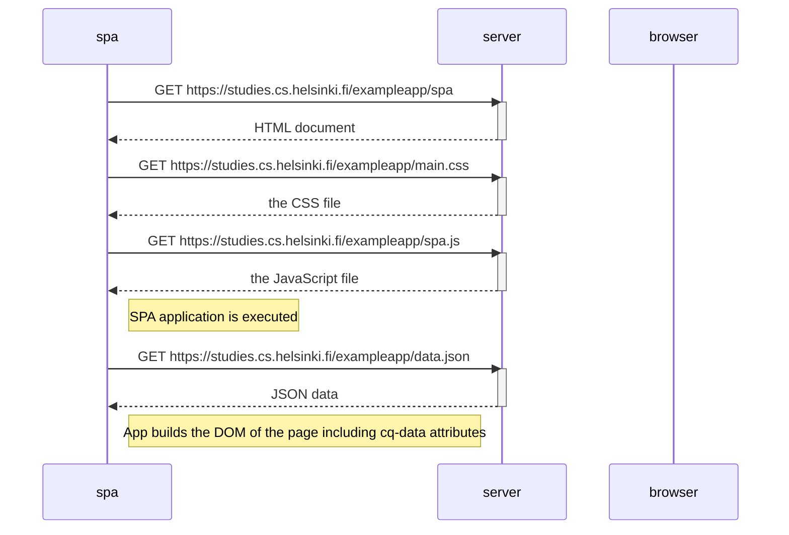

```mermaid
sequenceDiagram
    participant spa
    participant server
    participant browser
    
    spa->>server: GET https://studies.cs.helsinki.fi/exampleapp/spa
    activate server
    server-->>spa: HTML document
    deactivate server
    
    spa->>server: GET https://studies.cs.helsinki.fi/exampleapp/main.css
    activate server
    server-->>spa: the CSS file
    deactivate server
    
    spa->>server: GET https://studies.cs.helsinki.fi/exampleapp/spa.js
    activate server
    server-->>spa: the JavaScript file
    deactivate server
    
    Note right of spa: SPA application is executed
    
    spa->>server: GET https://studies.cs.helsinki.fi/exampleapp/data.json
    activate server
    server-->>spa: JSON data
    deactivate server
    
    Note right of spa: App builds the DOM of the page including cq-data attributes
    
```
