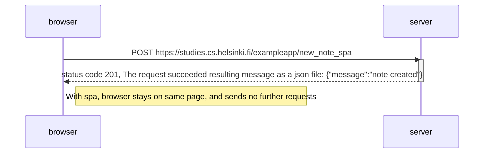

```mermaid
sequenceDiagram
    participant browser
    participant server
    
    browser->>server: POST https://studies.cs.helsinki.fi/exampleapp/new_note_spa
    activate server
    server-->>browser: status code 201, The request succeeded resulting message as a json file: {"message":"note created"}
    deactivate server

  Note right of browser: With spa, browser stays on same page, and sends no further requests

```
